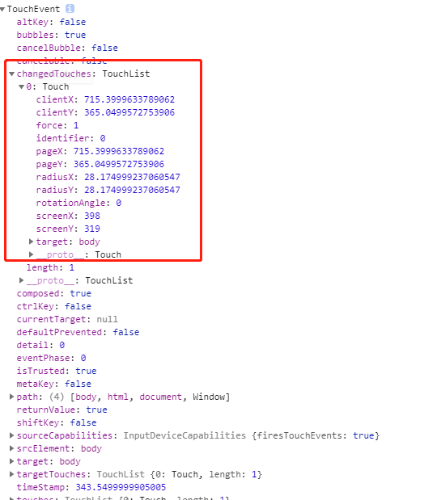
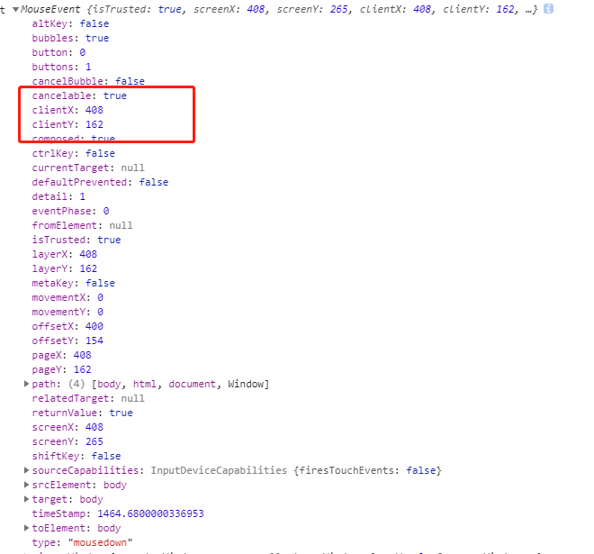
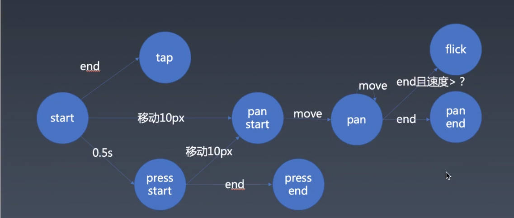

# 运行

```
cd ./carousel

npm run dev
```

# 手势

点击跳转功能

速度够快也能翻页

一开始是纵向滑动的时候再横向滑动不会移动图片

# 移动兼容问题

TouchEvent

xy 轴在 changTouches 数组里

# 手势库的设计

## 0. 手势介绍

业界常见的抽象：tap 点击，pan 拖拽物体，Flick 速度快的拖拽， Press 长按

## 兼容 Mouse 和 Touch 事件

mouse 事件在 mousedown 中监听 mousemove 和 mouseup，在 mouseup 中移除 mousemove 和 mouseup 的监听。

在 touch 事件中，touch 是锁定元素的，在哪里 start，move 和 up 也是在那里，不像 mouse 事件，当 mouseover 移动到某个元素，taget 是指向当前的元素，touchover 事件不是这样，它也依然是指向 touchstart 的元素。

考虑到 Touch 事件中的 changeTouches 是个数组，所以需要

```
element.addEventListener('touchstart', event => {
  // 考虑多指
  for (let touch of event.changedTouches) {
    start(touch);
  }
});
```

同时 Mouse 也是一样触发相同的方法，这样 Touch 和 Mouse 都是调用同个方法，之后对这个方法进行适配。

```
element.addEventListener('mousedown', event => {
  start(event);
})
```

point 是 Touch 或者 MouseEvent 这两个对象，都包括 clientX、clientY





## 了解手势触发的机制



## 額外

在触控屏这类设备中也需要支持指针事件
[Pointer events 指针事件](https://developer.mozilla.org/zh-CN/docs/Web/API/Pointer_events)