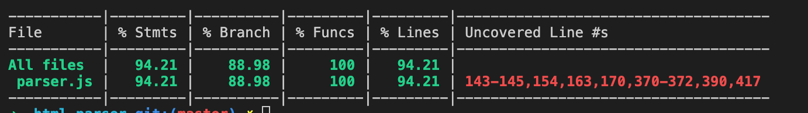

# 每周总结可以写在这里

# Dev 工具

Server

- build: webpack babel vue jsx postcss...
- watch: fsevent
- mock: ...
- http: wx

Client

- debugger: vscode devtool
- source map

> npm 能够作为一个库来使用

# fsevent

监听后，能够监听文件和文件夹的增删改状态。

```
{ path:
   '/Users/tanzhifeng/work/Frontend-01-Template/week18/watcher/2.js',
  flags: 65792,
  event: 'created',
  type: 'file',
  changes:
   { inode: false, finder: false, access: false, xattrs: false } }
```

> mac 下能够直接安装，window10 中无法安装依赖需要使用其他库

# 单元测试

单元测试的目标：自动化的结果评判，机器帮你评判对错，是否有管理测试用例。

通过 coverage 来检查我们的测试覆盖率，用来衡量测试编写的质量。

测试报告

coverage 报告：90%以上已经非常高，80%以下基本算没有。

可以将不重要的文件屏蔽掉。

# nyc

nyc只收集测试期间访问的源文件的覆盖率。

> nyc收集文件代码的覆盖率 的重要性比 mocha 更重要

# ava

> 在 node：10.13.0 版本中会出现`✖ Couldn't find any files to test ✖ Internal error`的报错，换成了 10.16.0 即可

```package.json
"ava": {
    "files": [
      "test/*.js"
    ],
    "require": [
      "@babel/register"
    ],
    "babel": {
      "testOptions": {
        "babelrc": true
      }
    }
  }
```

> @babel/register 的作用，在 node 后续运行时所需要 require 进来的扩展名为 .es6、.es、.jsx、 .mjs 和 .js 的文件将由 Babel 自动转换。

# macha

node版本在最新版本(14.8.0)中可以使用type="module"来开启对ES module的支持

mocha在没有配置`type="module"`时需要使用import语法时需要在nyc中额外配置：`"extends": "@istanbuljs/nyc-config-babel"`，同事babel中也需要添加对应的plugin`babel-plugin-istanbul`

> 使用了`type="module"`后 nyc mocha 无法得到文件的覆盖率

# jest

# 覆盖率



# 额外

sprite-core   
